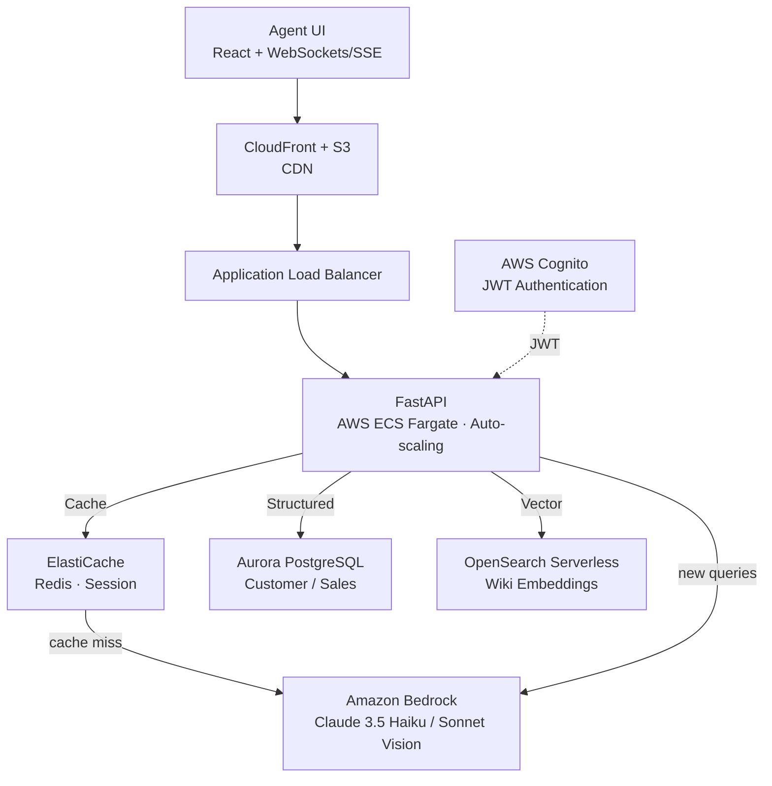
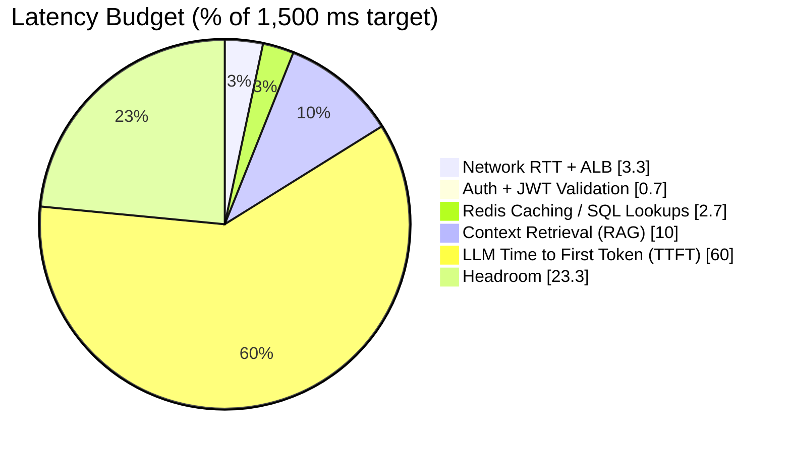
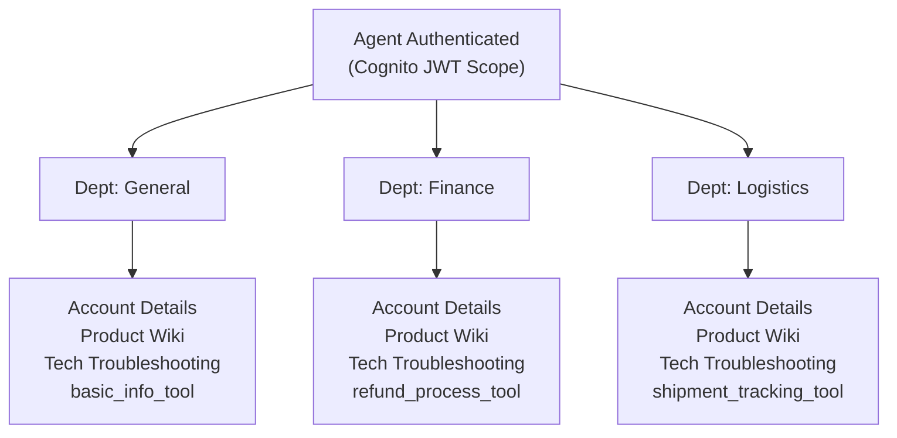
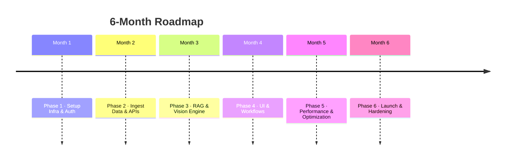

Here is a comprehensive enterprise blueprint and implementation roadmap to build this real-time, multi-tenant AI Agentic Platform on AWS.

---

## 1. System Architecture Overview

To support **1,000 concurrent agents** with an **end-to-end response time of $<1.5\text{s}$**, we cannot rely solely on standard Retrieval-Augmented Generation (RAG). We must implement a hybrid architecture: **SQL Tool Calling for structured data** (Customer/Sales XLS), **Vector Search for unstructured data** (Wiki), and **Aggressive Multi-Layer Caching**.



> The onboarding guide ([guides/README.md](guides/README.md)) presents this same architecture as technical, business/context, and UML sequence views.

---

## 2. AWS Services Plain-English Reference

To help our junior engineers get up to speed quickly, here is how AWS services map to standard Computer Science fundamentals:

| AWS Service | Simple Concept | Role in Our System |
| --- | --- | --- |
| **AWS S3** | Infinite File System / Cloud Hard Drive | Stores raw `.xlsx` files, images uploaded by agents, and exported wiki dumps. |
| **AWS CloudFront** | Global Content Delivery Network (CDN) | Delivers the React web app frontend instantly to agents with near-zero latency. |
| **AWS Cognito** | User Directory & OAuth Server | Handles agent logins, passwords, MFA, and embeds department roles directly into secure JWT tokens. |
| **AWS ECS (Fargate)** | Container Orchestrator (Docker in the cloud) | Hosts scalable FastAPI backends without us having to manage Linux servers or virtual machines. |
| **AWS Aurora PostgreSQL** | Relational Database (SQL) | Stores parsed structured data from spreadsheets (customers, orders, transactions). |
| **Amazon OpenSearch** | Search Engine + Vector Store | Stores vector embeddings of the product wiki for semantic search and fast RAG retrieval. |
| **Amazon ElastiCache** | In-Memory Key-Value Store (Redis) | Caches agent sessions, frequent database queries, and semantic LLM responses to hit sub-1.5s latency. |
| **Amazon Bedrock** | Serverless AI Model Gateway | Provides API access to foundation models (Claude 3.5 Haiku for speed, Sonnet for multimodal image troubleshooting). |
| **AWS Glue / Lambda** | Automated Scripts (ETL Pipeline) | Automatically parses incoming `.xlsx` files and wiki updates, converting them into database rows and vector embeddings. |

---

## 3. High-Performance Strategy (< 1.5s Latency Budget)

To guarantee responses in under 1.5 seconds under high concurrent load:



### Key Latency Rules

1. **Server-Sent Events (SSE) / WebSockets:** FastAPI streams tokens back to React. Agents see text appearing within 300–500ms rather than waiting for the entire payload to render.
2. **Model Selection:** Use **Claude 3.5 Haiku** on Bedrock for standard text/routing (ultra-fast TTFT). Route to **Claude 3.5 Sonnet** *only* when image troubleshooting is attached.
3. **Structured vs. Unstructured Data Separation:**
* **Do NOT vector-embed numerical spreadsheet data** (e.g., purchase dates, order totals). Parse `.xlsx` files straight into **AWS Aurora PostgreSQL**. When an agent asks for an order status, the LLM calls a deterministic SQL tool function ($<20\text{ms}$ lookup).
* **Vector-embed ONLY product wiki pages** into Amazon OpenSearch Serverless using HNSW indexing for instant semantic search.


---

## 4. Authentication, Department RBAC & AI Routing Logic

### Department Access Control Matrix



### Backend Enforcement (FastAPI Middleware)

Every request passes through a department validation dependency:

```python
# app/core/security.py
from fastapi import Depends, HTTPException, Security
from fastapi.security import HTTPBearer, HTTPAuthorizationCredentials
import jwt

security = HTTPBearer()

def get_current_agent(credentials: HTTPAuthorizationCredentials = Security(security)):
    token = credentials.credentials
    try:
        # Decode and verify JWT from AWS Cognito
        payload = decode_cognito_jwt(token)
        return {
            "agent_id": payload["sub"],
            "department": payload.get("custom:department") # General, Finance, or Logistics
        }
    except Exception:
        raise HTTPException(status_code=401, detail="Invalid session credentials")

```

### AI Department Routing Logic

If an agent in **General** receives a question about issuing a refund, the AI prompt layer intercepts this and strictly enforces routing:

```python
# app/services/ai_agent.py
DEPARTMENT_PERMISSIONS = {
    "General": ["view_product_info", "troubleshoot_hardware", "update_account"],
    "Finance": ["view_product_info", "troubleshoot_hardware", "process_refund", "verify_bank_transaction"],
    "Logistics": ["view_product_info", "troubleshoot_hardware", "track_shipment", "report_shipping_damage"]
}

SYSTEM_ROUTER_PROMPT = """
You are an AI Agentic Assistant for a Computer Store specializing in laptops, printers, and accessories.
Agent Assigned Department: {agent_department}
Allowed Capabilities: {allowed_tools}

RULES:
1. You may ONLY assist directly if the user query falls under your allowed capabilities.
2. If the customer query requires actions outside your department scope (e.g. Finance or Logistics), DO NOT execute or hallucinate an answer.
3. Immediately issue a structured routing alert:
   "ROUTING REQUIRED: This query involves [Finance/Logistics/General]. Please transfer this ticket to the [Department] department."
"""

```

---

## 5. Multimodal Vision Pipeline (Laptops & Printers Troubleshooting)

When a customer sends a picture of a broken laptop screen or a printer error screen (e.g., "Paper Jam Error Code 50.2"):

1. **Frontend:** React compresses the client image client-side to $<500\text{KB}$ and sends it as a base64 string or S3 Presigned URL.
2. **Backend:** FastAPI triggers Bedrock using Claude 3.5 Sonnet / Vision model.
3. **Structured Diagnostic Output:**
* **Identified Hardware:** e.g., HP LaserJet Enterprise M507.
* **Visual Evidence:** Paper feeding tray jam or damaged ribbon cable.
* **Action Plan:** Step-by-step diagnostic guide for the agent to read out loud to the customer.


---

## 6. 6-Month Execution Roadmap (4 Junior Developers)

To ensure clear ownership, pair your junior developers into 2 functional sub-teams:

* **Team Alpha (Dev 1 & Dev 2):** Frontend (React) + Auth/Security + API Integration.
* **Team Beta (Dev 3 & Dev 4):** Backend (FastAPI) + AWS Data Pipelines (ETL) + Bedrock LLM Orchestration.



### Phase 1: Foundation & Auth Setup (Month 1)

* **Team Alpha:** Setup React SPA repository (Vite + Tailwind + Zustand). Configure AWS Amplify/CloudFront hosting.
* **Team Beta:** Provision AWS infrastructure via Terraform or AWS CDK (Cognito, Aurora Postgres, ElastiCache, ECS Fargate, ALB).
* **Deliverable:** Secure login portal with AWS Cognito JWT authentication and department role assignment.

### Phase 2: Data Engineering & Parsing Pipeline (Month 2)

* **Team Alpha:** Build internal admin views for uploading spreadsheets and viewing agent access metrics.
* **Team Beta:** Build AWS Glue / Lambda scripts to parse incoming `.xlsx` spreadsheets (Customers, Purchase History, Sales) into Aurora PostgreSQL. Parse Wiki data into chunked Markdown.
* **Deliverable:** Automated data ingestion pipeline supporting immediate SQL queries for structured spreadsheets.

### Phase 3: Core AI Engine & Multimodal RAG (Month 3)

* **Team Alpha:** Implement chat window UI in React supporting markdown formatting, real-time token streaming, and drag-and-drop image uploads.
* **Team Beta:** Implement OpenSearch Serverless vector store for Wiki embeddings. Configure FastAPI with AWS Bedrock SDK, custom tool definitions, and Claude 3.5 Sonnet vision capabilities.
* **Deliverable:** Working FastAPI endpoints processing text/image queries and returning RAG-backed answers with tool calling.

### Phase 4: Department Guardrails & Routing Workflows (Month 4)

* **Team Alpha:** Build UI badges, department-specific action buttons, and visual transfer/routing notifications.
* **Team Beta:** Integrate FastAPI RBAC middleware. Program the AI system prompt to enforce departmental limits and return transfer prompts when out-of-scope actions are triggered.
* **Deliverable:** Full end-to-end routing system preventing unauthorized department actions.

### Phase 5: Performance Tuning, Caching & Load Testing (Month 5)

* **Team Alpha:** Optimize bundle sizes, implement virtualized chat lists, and tune client-side rendering performance.
* **Team Beta:** Set up Redis multi-layer caching (Semantic Response Cache + SQL result cache). Run Locust load testing simulating 1,000 active agents to hit the $<1.5\text{s}$ target.
* **Deliverable:** System validated to sustain 1,000 concurrent agents under sub-1.5s latencies.

### Phase 6: UAT, Hardening & Production Rollout (Month 6)

* **Team Alpha & Beta:** Complete security audits, set up CloudWatch monitoring alerts, run UAT with key agent leads, write API documentation, and execute production release.
* **Deliverable:** Live production deployment supporting 1,000 active customer support agents.

---

### Suggested Next Steps

To move forward into execution, we can dive deeper into any of the following:

1. **Database Schema Design:** Define the exact SQL tables for Aurora Postgres and vector chunking strategy for the product wiki.
2. **Infrastructure as Code (IaC):** Generate Terraform / AWS CDK scripts to provision Cognito, ECS, and Bedrock automatically.
3. **FastAPI & React Streaming Boilerplate:** Review a ready-to-run code template using FastAPI Server-Sent Events (SSE) and Bedrock's streaming response API.